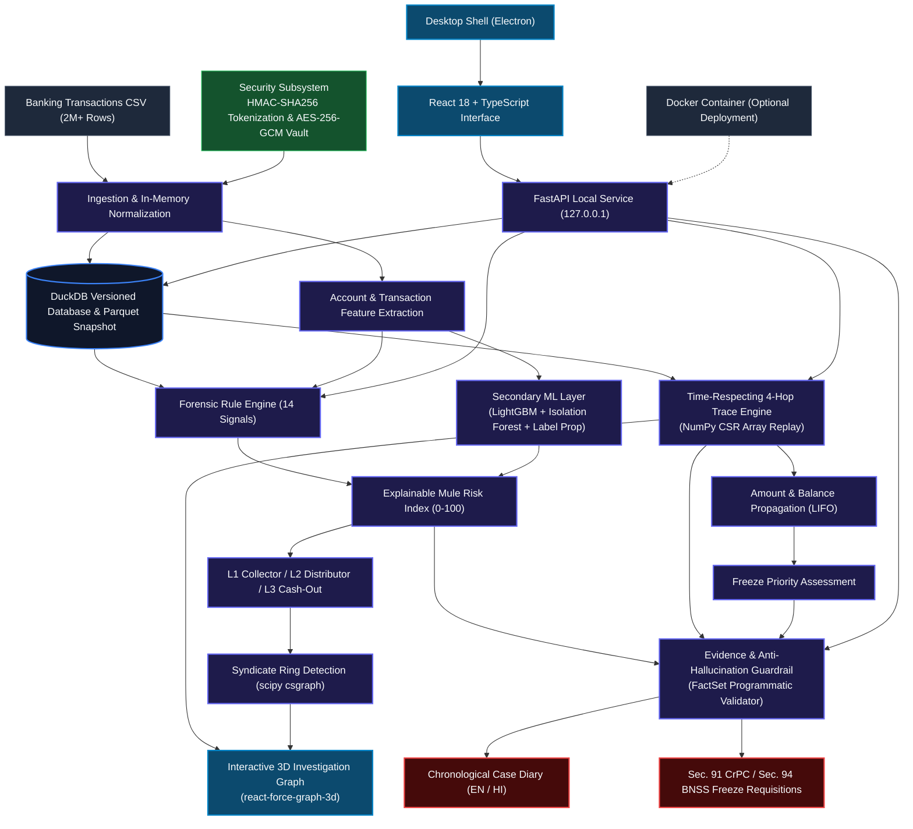

# NIRIKSHAK

### Offline Financial Cybercrime Investigation & Money-Mule Network Intelligence

[](https://www.python.org/)
[](https://fastapi.tiangolo.com/)
[](https://duckdb.org/)
[](https://react.dev/)
[](https://www.typescriptlang.org/)
[](https://www.electronjs.org/)
[](https://www.docker.com/)
[](https://arrow.apache.org/)

NIRIKSHAK is a specialized, fully offline digital-forensics intelligence platform built for financial cybercrime investigators and law-enforcement officers tracing multi-tier money-mule syndicates. Operating directly on millions of banking transaction records, it reconstructs complex money-laundering rings through high-throughput columnar ingestion and automated graph-topology heuristics. 

By enforcing strict temporal sequencing and dynamic amount propagation, NIRIKSHAK isolates valid fund movements across up to 4 hops, eliminating physically impossible reverse-time flows. Every identified mule is scored via an explainable behavioral index, mapped across structural laundering tiers, and instantly transformed into court-ready case diaries and statutory bank freeze requisitions without sending sensitive financial data to the cloud.

---

## Operation Abhedya-Chakra

Developed for **Void Hacks() 8.0** under the **Cyber Security & Digital Forensics** track presented with the context of the **Indore Police Commissionerate**, NIRIKSHAK tackles the forensic bottlenecks of large-scale financial fraud:

* **Massive Computational Scale:** Analyzing 2,000,000+ multi-bank transaction ledgers without high-end cloud infrastructure or out-of-memory crashes on investigative laptops.
* **Multi-Tier Money Mule Topologies:** Automatically unmasking complex laundering architectures—differentiating **L1 Collectors** (high fan-in receiving initial victim funds), **L2 Distributors** (rapid fan-out smurfing and structuring), and **L3 Terminal Accounts** (cryptocurrency P2P gateways, wallet loads, and cash-out points).
* **Layering & Rapid Dispersal:** Countering automated smurfing scripts that cycle and disperse stolen funds across diverse IFSC branches within minutes.
* **Evidentiary Bottlenecks:** Eradicating the manual overhead of drafting Section 91 CrPC / Section 94 BNSS freeze notices, while ensuring 100% factual accuracy against source financial records.

---

## What NIRIKSHAK Does

The platform executes a unified forensic pipeline from raw bank exports to actionable freeze orders:

```text
2M Banking Transactions (Raw CSV / Parquet)
        ↓
Validation & Normalization (SQL validation, reject logging, IFSC/rail normalization, narration PII masking)
        ↓
Feature Extraction (Cumulative outflow, ASOF velocity passes, distinct counterparties, IP/device categorization)
        ↓
Rule Engine + ML (14 behavioral forensic indicators + LightGBM & Isolation Forest secondary ensemble)
        ↓
Mule Risk Index (0–100 explainable score with itemized evidential justifications)
        ↓
L1 / L2 / L3 Classification (Structural role categorization: Collector vs. Distributor vs. Terminal Sink)
        ↓
Time-Respecting 4-Hop Trace (Sub-millisecond forward propagation matching ledger order & LIFO allocation)
        ↓
3D Investigation Graph (Interactive force-directed topology with minute-by-minute playback & ring isolation)
        ↓
Freeze Priority (Quantitative identification of accounts currently holding traceable funds)
        ↓
Evidence Layer (FactSet verification: cross-referencing all accounts, IFSCs, amounts, and timestamps)
        ↓
Case Diary / Freeze Requisition (Statutory notices in English & Hindi with zero hallucinations)
```

1. **Ingests & Normalizes:** Ingests 2M+ rows in seconds, validates account/IFSC formats, filters anomalies, and masks raw PII.
2. **Profiles & Scores:** Computes an explainable 0–100 Mule Risk Index (MRI) via 14 distinct forensic signals backed by an ML second opinion.
3. **Classifies Syndicates:** Organizes suspect accounts into L1, L2, and L3 operational layers and clusters connected components into discrete syndicate rings.
4. **Traces Money Flows:** Computes precise, time-respecting multi-hop forward trails from victim accounts using memory-mapped sparse matrices.
5. **Pinpoints Trapped Funds:** Identifies active balances across downstream nodes to establish an actionable Freeze Priority list.
6. **Compiles Evidence:** Generates tamper-evident case diaries and per-bank freeze requisitions (CrPC §91 / BNSS §94) verified by programmatic guardrails.

---

## Core Architecture



---

## Core Modules

### Module A — High-Throughput Ingestion
* **Parallel Columnar Streaming:** Leverages DuckDB vectorization with an explicit schema to load 2,000,000+ CSV transactions without intermediate memory bloat.
* **SQL Validation & Hygiene:** Evaluates every record against RE2 regular expressions for account numbers (4 bank letters + 8 digits or 12 digits), IFSC codes, valid numeric amounts, and timestamps, recording rejected rows with explicit failure reasons.
* **Normalization & Sanitization:** Resolves IFSCs to bank institutions, normalizes payment rails (UPI, IMPS, NEFT, RTGS), strips control characters, categorizes foreign proxy IPs (`185.x`, `194.x`) before `/24` masking, and substitutes narration PII (phone numbers, UPI IDs, emails, crypto wallets) with deterministic keyed tokens.
* **Versioned Storage:** Writes fresh encrypted database instances (`nirikshak_v{N}.duckdb`) and Parquet snapshots in a separate background worker, avoiding file-locking collisions on Windows.
* **Instant Account Lookups:** Provides sub-second HTTP search across millions of records by full real account number (HMAC-matched), masked suffix (last-4), or unique transaction identifier.

### Module B — Mule Detection & Graph Analytics
* **Behavioral Heuristics:** Computes 14 distinct forensic signals including pass-through velocity (≥90% inflow dispersed within 15 minutes), fan-out slicing (bursts into 3–7 accounts), collector fan-in, cyclical round-tripping, and terminal sink retention.
* **Explainable Mule Risk Index:** Evaluates accounts on an intuitive 0–100 scale, generating an itemized natural-language rationale for every flagged signal with measured values (e.g., exact dwell times, pass-through percentages).
* **Layer Classification:**
  * **L1 Collectors:** High fan-in accounts receiving direct victim disbursements and immediately dispersing forward.
  * **L2 Distributors:** Layering accounts receiving collector funds and rapidly splitting them across multiple parallel paths.
  * **L3 Terminal Sinks:** Cash-out accounts retaining ≥90% of mule-funded inflows, utilizing crypto P2P markers, or transacting via automated headless environments.
* **Syndicate Ring Clustering:** Runs connected components analysis (`scipy.sparse.csgraph`) over suspect-to-suspect transactions to isolate discrete criminal networks.

### Module C — Investigation Graph
* **4-Hop Temporal Trace:** Executes recursive forward tracking from a victim's debit through up to 4 downstream transfers using high-speed NumPy Compressed Sparse Row (CSR) index arrays.
* **Time-Respecting Integrity:** Mandates that a downstream transfer is only recognized if it occurs strictly at or after the incoming tainted credit timestamp.
* **LIFO Amount Tracking:** Implements Last-In, First-Out ledger allocation to propagate proportional tainted balances rather than treating graph paths as unweighted topological links.
* **3D Interactive Canvas:** Powered by `react-force-graph-3d` and Three.js, rendering multi-thousand-node rings at smooth frame rates with customizable node coloring by layer, edge thickness by transfer volume, and node isolation.
* **Temporal Playback:** A dynamic scrubber allowing investigators to replay laundering flows minute-by-minute over the entire 15-day timeline.

### Module D — Case Officer & Legal Evidence
* **FactSet Anti-Hallucination Guardrail:** Extracts all accounts, IFSCs, transaction IDs, amounts, and timestamps from generated legal texts and strictly cross-checks them against the database facts. Any unsupported claim is dropped immediately.
* **Statutory Freeze Requisitions:** Automatically drafts section 91 CrPC / section 94 BNSS notices partitioned per beneficiary bank, ready for immediate judicial or police dispatch.
* **Bilingual Documentation:** Produces comprehensive chronological Case Diaries and Freeze Notices in both English and Hindi.
* **Freeze Priority Calculation:** Ranks active suspect accounts by the exact quantum of siphoned capital currently residing in their balance, providing an immediate checklist for asset recovery.
* **Tamper-Evident Export:** Embeds the cryptographic SHA-256 hash of the ingested dataset directly onto exported PDF and HTML records to establish strict chain-of-custody integrity.

---

## Why NIRIKSHAK?

### 1. Time-Respecting Money Trail
Standard graph algorithms (BFS/DFS) identify topological reachability but ignore timestamps, frequently reporting "flows" where money transfers occurred days *before* the victim was defrauded. NIRIKSHAK enforces temporal causality: an outbound hop is valid if and only if it occurred after the inbound credit.

### 2. Amount-Propagating Trace
Rather than treating all connections as binary edges, NIRIKSHAK allocates funds through a LIFO ledger simulation. If an L1 mule receives ₹1,00,000 from a victim and ₹50,000 from legitimate sources, only the tainted ₹1,00,000 is propagated through downstream distributions.

### 3. Explainable Mule Risk Index
Black-box risk scores are inadmissible in legal proceedings. NIRIKSHAK accompanies every score with a human-readable, mathematical justification detailing exact dispersal velocities, transfer counts, median dwell times, and counterparty risks.

### 4. Dual Rule + ML Intelligence
Deterministic forensic rules serve as the primary, legally accountable scoring framework. Machine learning models (LightGBM, Isolation Forest) operate in parallel to provide unsupervised anomaly validation and cross-validation without overriding verifiable forensic rules.

### 5. Actionable Freeze Priority
Investigating officers have limited time to issue bank notices. NIRIKSHAK calculates the exact retained balance in each downstream account at the end of the transaction window, allowing officers to target accounts holding trapped funds first.

### 6. Evidence-Grounded Documents
All generated case diaries and freeze requests are constructed directly from validated transaction ledgers. Programmatic guardrails reject any output containing non-existent account numbers or mismatched monetary values.

### 7. Privacy by Design
Real account numbers are never exposed in plaintext analysis tables or stored in temporary memory. Deterministic HMAC tokenization preserves structural graph relationships while sensitive identifiers remain encrypted in an AES-256-GCM vault.

### 8. Fully Local Workflow
Financial transaction databases contain sensitive banking information that cannot be uploaded to external APIs. NIRIKSHAK operates completely offline on local hardware, requiring zero external cloud connections.

---

## Mule Risk Engine

```text
                        Transaction Behaviour
                                  ↓
    ┌───────────────────────────────────────────────────────────┐
    │  • Velocity (Inflow dispersed in ≤15m)    • Relay Pass-Through│
    │  • Fan-in Slicing                         • Fan-out Slicing   │
    │  • Dwell Time Quantiles                   • 2- & 3-Cycles     │
    │  • Terminal Sink Retention                • Crypto / Wallets  │
    │  • Foreign Proxy IPs (185.x / 194.x)      • Headless Devices  │
    │  • Scripted Inflow Channels               • Scam Narration    │
    │  • Layering Markers                       • Mule-Funded Inflow│
    └───────────────────────────────────────────────────────────┘
                                  ↓
                        Forensic Rule Score
                                  ↓
                        ML Auxiliary Signals
                                  ↓
                    Final Configured Score (0–100)
```

The **Mule Risk Index (MRI)** is an explainable indicator (scaled 0 to 100) representing how strongly an account's observed financial behavior matches established money-mule and smurfing heuristics. 

> [!NOTE]
> The Mule Risk Index is an objective behavioral similarity score; it is **not** a legal determination or a probabilistic calculation of criminal guilt.

### Core Signals & Weighting Matrix

| Signal | Forensic Definition | Weight |
|---|---|---:|
| **High-Velocity Pass-Through** | Share of credit volume where ≥90% leaves within 15 minutes across ≥2 outgoing transfers (vectorized ASOF pass) | 40 |
| **Relay Pass-Through** | Single-hop forwarding within 60 minutes. Evaluated as `max(40·velocity, 25·relay)` | 25 |
| **Fan-Out Slicing** | Outbound splitting into 3–7 parallel transfers (standard smurfing window) | 10 |
| **Collector Fan-In** | Multiple distinct victim senders forwarded into a single node | 8 |
| **Cash-Out Outflow** | Outbound transfers marked with cryptocurrency P2P or wallet load identifiers | 12 |
| **Cash-Out Inflow** | Inflow marked with terminal cash-out identifiers | 20 |
| **Foreign Proxy IP** | Outbound transactions initiated from designated foreign proxy ranges (`185.x`, `194.x`) | 10 |
| **Headless Device** | Activity originating from scripted clients (`Web_Emulator`, `Linux_Script`) | 10 |
| **Scripted Funding** | Inflow funded via headless or foreign proxy origins | 15 |
| **Scam-Lure Credits** | Inflow matching known fraud narrations (`TASK`, `REFUND`, `LOTTERY`, `KYC`) | 10 |
| **Layering Marker** | Transactions bearing internal routing markers (`P2A`, `INTERNAL_SETTLEMENT`) | 5 |
| **Round-Tripping** | Closed 2- and 3-node cycles returning 50–105% of capital within 6 hours | 15 |
| **Mule-Funded Inflow** | Proportion of inbound funds received from already-identified high-risk mules (propagated 2 hops) | 15 |
| **Terminal Sink** | Accounts retaining ≥90% of total inflows where ≥50% is mule-funded | 25 |

Accounts scoring **MRI ≥ 40** are classified as flagged mules. Layer assignment is determined by structural topology:
* **L3 (Terminal):** Identified terminal sinks holding funds.
* **L2 (Distributor):** Accounts routing ≥50% of outflow toward L3 accounts or cash-out markers.
* **L1 (Collector):** High fan-in intermediary accounts receiving external funds and funneling them into distributors.
* **Victim:** Non-mule accounts (MRI < 40) directly debited into an L1 collector.

---

## ML / AI Layer

NIRIKSHAK maintains a clear separation between primary deterministic rules and auxiliary machine learning models.

```text
               ┌────────────────────────────────────────────────────────┐
               │         Primary Forensic Logic (Rules Engine)          │
               │  Deterministic • Auditable • Legal Notices • Layers    │
               └───────────────────────────┬────────────────────────────┘
                                           │
                        ┌──────────────────┴──────────────────┐
                        ▼                                     ▼
     ┌─────────────────────────────────────┐   ┌────────────────────────────────┐
     │       Supervised Learning           │   │      Unsupervised Anomaly      │
     │      LightGBM (150 Trees)           │   │    Isolation Forest (100 Trees)│
     │  Trained on Rule Pseudo-Labels      │   │   Identifies Top 1% Structural │
     │  TreeSHAP Feature Contributions     │   │   Outliers for Manual Review   │
     └──────────────────┬──────────────────┘   └────────────────┬───────────────┘
                        │                                       │
                        └──────────────────┬────────────────────┘
                                           ▼
                       ┌────────────────────────────────────────┐
                       │     Graph Label Propagation (scipy)    │
                       │     Iterative Network Score Bleed      │
                       └───────────────────┬────────────────────┘
                                           ▼
                       ┌────────────────────────────────────────┐
                       │       Weighted Ensemble Score          │
                       │  Rule 0.55 • LightGBM 0.25 • LP 0.15   │
                       │        • Isolation Forest 0.05         │
                       └────────────────────────────────────────┘
```

### Components
* **Forensic Rules (Primary):** All statutory legal notices, layer classifications, and primary risk badges are strictly generated from the deterministic rule engine.
* **LightGBM Classifier:** 150 gradient-boosted decision trees trained over 20 graph and transaction features (in/out degree, PageRank, dwell times, channel ratios). Provides feature importance attribution via TreeSHAP values.
* **Isolation Forest:** 100 isolation trees generating an unsupervised anomaly score across the feature space, flagging structural anomalies that may bypass strict rule thresholds.
* **Label Propagation:** Semi-supervised network propagation diffusing risk scores across transaction edges to detect closely connected associates.
* **Weighted Ensemble:** Calculates a composite metric: `0.55 · Rule + 0.25 · LightGBM + 0.15 · LabelProp + 0.05 · IsolationForest`.
* **Optional Local LLM (Ollama):** Supports offline conversational case summaries using locally hosted models. The prompt is populated with opaque placeholders (`{{ACC_1}}`, `{{AMT_1}}`) rather than raw database strings. Generated responses pass through the FactSet guardrail before display. If Ollama is unavailable, NIRIKSHAK defaults to deterministic template generation.

> [!IMPORTANT]
> **Dataset Ground-Truth Limitation:** The hackathon transaction dataset does not include independently verified, supervised ground-truth fraud labels. Consequently, the ML models are trained using rule-derived pseudo-labels (positives ≥ 75, negatives ≤ 5). While 3-fold cross-validation achieves high separation, this demonstrates model fidelity to the rule boundary rather than external real-world fraud classification.

---

## 4-Hop Forensic Trace

A single hop represents **one direct account-to-account transfer**.

```text
┌──────────────┐     Hop 1      ┌──────────────┐     Hop 2      ┌──────────────┐     Hop 3      ┌──────────────┐     Hop 4      ┌──────────────┐
│    Victim    │ ─────────────> │ L1 Collector │ ─────────────> │L2 Distributor│ ─────────────> │L2 Distributor│ ─────────────> │  L3 Terminal │
│ (Kotak Bank) │                │  (HDFC Bank) │                │  (ICICI Bank)│                │  (Axis Bank) │                │  (Crypto/P2P)│
└──────────────┘                └──────────────┘                └──────────────┘                └──────────────┘                └──────────────┘
```

### Topological Graph Traversal vs. Time-Respecting Trace

* **Standard Graph Traversal:** Identifies any directed path between nodes ($A \to B \to C$), ignoring when transactions occurred. It risks following reverse-time artifacts where money appears to move from $B$ to $C$ hours *before* $A$ paid $B$.
* **NIRIKSHAK Time-Respecting Trace:** Combines graph topology with strict chronological ordering and ledger balance constraints:
  $$\text{Timestamp}(T_{\text{out}}) \ge \text{Timestamp}(T_{\text{in}})$$

### Forward Propagation Example
Consider the following transaction log:
* `10:00:00` — Victim transfers ₹5,00,000 to Account A
* `10:04:12` — Account A transfers ₹2,50,000 to Account B *(Valid Hop 1: Occurred after credit)*
* `10:08:45` — Account B transfers ₹2,40,000 to Account C *(Valid Hop 2: Occurred after credit)*
* `09:45:00` — Account A transfers ₹1,00,000 to Account D *(Invalid: Preceded victim's credit; excluded from money trail)*

NIRIKSHAK replays each account's ledger using LIFO accounting, ensuring that later incoming credits from unrelated entities do not falsely contaminate an ongoing trace.

---

## Privacy & Account Protection

NIRIKSHAK is engineered to comply with strict investigative privacy protocols:

```text
┌──────────────────────┐
│  Real Account Number │ (e.g., KKBK10000300)
└──────────┬───────────┘
           │
           ▼  HMAC-SHA256(Key_Account, Account)
┌──────────────────────┐
│   Pseudonym Token    │ (e.g., tk7f3a9b1c2d4e8f)
└──────────┬───────────┘
           │
           ├──────────────────────────────┐
           ▼                              ▼
┌──────────────────────┐      ┌────────────────────────┐
│ Graph Analytics & DB │      │   Officer GUI Display  │
│ (Tokens Only)        │      │   "XXXXXXXX0300"       │
└──────────────────────┘      └───────────┬────────────┘
                                          │
                                          ▼  Officer PIN Verification
                              ┌────────────────────────┐
                              │  AES-256-GCM Vault     │
                              │  (In DuckDB Storage)   │
                              └───────────┬────────────┘
                                          │
                                          ▼
                              ┌────────────────────────┐
                              │ Plaintext Court Notice │ (Audited & Logged)
                              └────────────────────────┘
```

* **HMAC Pseudonymization:** All raw account identifiers are transformed into deterministic 16-character HMAC-SHA256 tokens before being indexed in analytical tables.
* **Distinction Between HMAC & Encryption:** HMAC provides one-way, deterministic keyed tokenization to preserve join integrity across tables; it is not reversible encryption.
* **AES-256-GCM Keyed Vault:** Reversible mapping from tokens back to real account numbers is stored exclusively in an AES-256-GCM encrypted vault within the DuckDB container.
* **Master Key Management:** The 32-byte master encryption key is generated upon first setup and secured within the OS credential store (Windows Credential Manager via Python `keyring`) or a protected local keyfile using HKDF key derivation.
* **Masked Display:** The user interface displays masked account representations (`XXXXXXXX1234`) by default.
* **PIN-Protected Reveal & Tamper-Evident Audit:** Viewing plaintext account numbers or generating official Section 91 court notices requires entry of the officer PIN. Every decryption action is permanently recorded in a hash-chained, tamper-evident audit log.
* **Narration PII Masking:** Phone numbers, personal UPI IDs, emails, and crypto addresses embedded in narrations are stripped of raw text and replaced with keyed references (`[LABEL#<hash>]`).

---

## Fully Local / Offline Architecture

NIRIKSHAK is entirely self-contained and operates without third-party network requests:

```text
               INVESTIGATIVE WORKSTATION (LOCAL HOST)
                                  │
    ┌─────────────────────────────┼─────────────────────────────┐
    │                             │                             │
    ▼                             ▼                             ▼
┌───────────────┐         ┌───────────────┐             ┌───────────────┐
│ React 18 UI   │ <=====> │ FastAPI Core  │ <=========> │ DuckDB Store  │
│ (Port 5173 or │  HTTP   │ (Port 8000 on │  Read-Only  │ (Versioned    │
│ Electron App) │         │  127.0.0.1)   │   Memory    │  Local Files) │
└───────────────┘         └───────┬───────┘             └───────────────┘
                                  │
                                  ▼
                        ┌───────────────────┐
                        │ Local Dataset CSV │
                        └───────────────────┘
```

* **Zero Cloud Dependency:** No external cloud services, remote telemetry, or web tracking.
* **Localhost Binding:** API services bind strictly to `127.0.0.1`.
* **In-Memory Analytics:** Graph algorithms and vector operations execute entirely in local RAM.
* **Self-Contained Typography:** Includes local Noto Sans and Devanagari font families for rendering court-compliant PDF documents offline.
* **Local LLM Integration:** If enabled, LLM inference routes through a local Ollama instance (`http://127.0.0.1:11434`) without external API calls.

---

## Windows Desktop Application

For non-technical field officers, NIRIKSHAK packages as a native Windows desktop installer:

```text
Windows Installer (Nirikshakk-Setup.exe)
       ↓
NIRIKSHAK Desktop Shell (Electron)
       ↓
Local User Interface (Bundled React SPA)
       ↓
Embedded Python Backend (PyInstaller Executable on 127.0.0.1)
       ↓
Encrypted DuckDB Database & Local Datasets (%LOCALAPPDATA%\Nirikshakk)
```

### End-User Operational Workflow
1. **Installation:** Run `Nirikshakk-Setup.exe` (per-user NSIS installer; administrator privileges not required).
2. **First-Run Wizard:** Set an investigative officer PIN, acknowledge offline privacy protocols, and select local data storage paths.
3. **Dataset Ingestion:** Open the Import modal and select any transaction CSV export.
4. **Interactive Investigation:** Trace victim disbursements, inspect the 3D syndicate graph, and isolate high-risk clusters.
5. **Notice Generation:** Export Section 91 CrPC / Section 94 BNSS requisitions and Case Diaries directly to PDF.

### Packaging Commands
Desktop builds are generated using PyInstaller for the backend sidecar and electron-builder for the installer:

```powershell
# 1. Build the frontend production bundle
cd frontend
npm ci
npm run build

# 2. Package the Python backend sidecar
cd ..\backend
.venv\Scripts\pip install -r requirements.txt
.venv\Scripts\pyinstaller nirikshak_backend.spec --noconfirm

# 3. Assemble the NSIS Windows installer
cd ..\desktop
npm ci
npm run dist
```
*Resulting installer:* `desktop\dist\Nirikshakk-Setup.exe` (~203 MiB).

> [!NOTE]
> **Code-Signing Status:** The installer executable is unsigned. On systems where Windows Smart App Control or SmartScreen is actively enforced, select **More info → Run anyway** to execute.

---

## Docker & Linux

A reproducible containerized deployment path is provided for Linux servers and development environments:

```text
Docker Host Engine
  ├── backend container: FastAPI + DuckDB (Port 8000)
  └── frontend container: Nginx + React Single Page App (Port 5173)
```

### Verified Deployment Commands
```bash
# Build and launch both containers in the background
docker compose up --build -d

# Verify service health status
docker compose ps

# Access the interface
open http://localhost:5173
```
*Dataset ingestion in Docker:* Place raw CSV files into `backend/data/` (mounted into `/app/data` inside the container) and initiate ingestion via the web dashboard.

*Verification Note:* Implemented; environment-specific verification required based on active Docker engine configurations.

---

## Technology Stack

| Layer | Technology | Version / Specification | Purpose in NIRIKSHAK |
|---|---|---|---|
| **User Interface** | React | 18.2 | Component-driven reactive investigation dashboard |
| **Language** | TypeScript | 5.6 | Strict type-safety across forensic data models |
| **Styling** | Tailwind CSS | 4.2 | High-density cybersecurity dark UI layout |
| **Animations** | Framer Motion | 12.3 | Micro-interactions and drawer state transitions |
| **Graph Visualization** | react-force-graph-3d | 1.27 | WebGL-accelerated 3D force-directed network display |
| **3D Rendering** | Three.js | 0.183 | GPU camera controls, node meshes, and spatial rendering |
| **Backend Framework** | FastAPI | 0.110+ | Asynchronous REST service running on 127.0.0.1 |
| **Application Server** | Uvicorn | 0.29+ | High-throughput ASGI server |
| **Analytics Engine** | DuckDB | 1.3+ | Embedded vector-SQL execution and columnar queries |
| **Columnar Storage** | PyArrow / Parquet | 15.0+ | Serialized tokenized transaction snapshots |
| **Graph Array Engine** | NumPy | 1.26+ | Compressed Sparse Row (CSR) matrices for microsecond traces |
| **Network Clustering** | SciPy | 1.11+ | Connected components clustering via `scipy.sparse.csgraph` |
| **Supervised ML** | LightGBM | 4.3+ | 150 gradient-boosted trees for feature-based scoring |
| **Unsupervised Anomaly** | scikit-learn | 1.6.1 | Isolation Forest for multivariate outlier detection |
| **Cryptography** | cryptography | 42.0+ | AES-256-GCM vault, HKDF derivation, HMAC-SHA256 tokens |
| **Credential Storage** | keyring | 25.0+ | Interfacing with Windows Credential Manager |
| **Document Generation** | fpdf2 | 2.7.9+ | Structured PDF generation for Case Diaries and notices |
| **Typography Shaping** | uharfbuzz | 0.39+ | HarfBuzz text shaping for correct Devanagari Hindi font rendering |
| **Local LLM (Optional)**| Ollama | Local REST | Optional natural-language narrative synthesis |
| **Desktop Shell** | Electron | 34.0+ | Native desktop windowing and backend process supervisor |
| **Desktop Packaging** | PyInstaller | 6.11+ | Standalone Python runtime bundling for the backend |
| **Installer System** | electron-builder / NSIS | 25.0+ | Self-contained Windows installer creation |
| **Automated Testing** | pytest | 8.0+ | Unit and integration test suite across backend modules |
| **End-to-End QA** | Playwright | 1.48+ | Headless automated UI verification and user-flow testing |
| **Containerization** | Docker Compose | 2.0+ | Reproducible multi-container offline deployment |

---

## Quick Start

### 1. Windows Desktop App (End-User Mode)
1. Download or compile `Nirikshakk-Setup.exe`.
2. Double-click the installer and complete installation.
3. Launch **NIRIKSHAK** from the Start Menu or Desktop.
4. Complete the 30-second initial setup wizard (choose data directory, configure PIN).
5. Navigate to **Import**, select your local transaction CSV, and begin analysis.

### 2. Developer Mode (Source Execution)
*Prerequisites:* Python 3.12, Node.js 18+, 8 GB RAM minimum (16 GB recommended).

```bash
# Clone the repository
git clone https://github.com/Shreyanshtiwarii/Nirakshak.git
cd Nirakshak

# --- Option A: Quick-Launch Scripts ---
# Windows
run.bat
# or PowerShell
powershell -ExecutionPolicy Bypass -File run.ps1

# Linux / macOS
chmod +x run.sh
./run.sh

# --- Option B: Manual Setup ---
# Backend Setup
cd backend
python -m venv .venv
source .venv/bin/activate  # Windows: .venv\Scripts\activate
pip install -r requirements.txt
uvicorn app.main:app --port 8000

# Frontend Setup (in a separate terminal)
cd frontend
npm install
npm run dev
```
Open [http://127.0.0.1:5173](http://127.0.0.1:5173) in your browser.

#### CLI Ingestion Utilities
```bash
cd backend
# Ingest raw dataset directly
python scripts/ingest.py data/VoidHacks8_MuleAccount_2M_Transactions.csv

# Rebuild database from tokenized Parquet snapshot
python scripts/ingest.py --from-parquet

# Recalculate risk scores after modifying config/detection.toml
python scripts/ingest.py --rescore
```

### 3. Docker Deployment
```bash
# Build and start services
docker compose up --build

# Backend documentation available at http://localhost:8000/docs
# Web dashboard available at http://localhost:5173
```

---

## Dataset

NIRIKSHAK is evaluated on the official **Void Hacks() 8.0** banking dataset:
* **Record Count:** 2,000,000 transactions
* **Storage Footprint:** ~286 MB uncompressed CSV
* **Accounts Profiled:** 24,873 unique accounts across 10 distinct Indian banking IFSC prefixes

### Schema Structure
```text
┌─────────────────────────┬──────────────┬───────────────────────────────────────────────────────┐
│ Column Name             │ Type         │ Forensic Description                                  │
├─────────────────────────┼──────────────┼───────────────────────────────────────────────────────┤
│ Transaction_ID          │ VARCHAR      │ Unique transaction identifier                         │
│ Sender_Account          │ VARCHAR(12)  │ Originating bank account number                       │
│ Receiver_Account        │ VARCHAR(12)  │ Beneficiary bank account number                       │
│ Sender_IFSC             │ VARCHAR(11)  │ Originating bank IFSC routing code                    │
│ Receiver_IFSC           │ VARCHAR(11)  │ Beneficiary bank IFSC routing code                    │
│ Amount                  │ DECIMAL(12,2)│ Transfer value in Indian Rupees (INR)                 │
│ Timestamp               │ TIMESTAMP    │ Transaction timestamp (YYYY-MM-DD HH:MM:SS)           │
│ Payment_Mode            │ VARCHAR      │ Transfer channel (UPI, IMPS, NEFT, RTGS)              │
│ Narration               │ VARCHAR      │ Payment reference text, remarks, and metadata         │
│ IP_Address              │ VARCHAR      │ Originating client IP address                         │
│ Device_Type             │ VARCHAR      │ Device signature (Android, iOS, Web_Emulator, etc.)   │
└─────────────────────────┴──────────────┴───────────────────────────────────────────────────────┘
```

> [!NOTE]
> **Data Security:** Raw transaction CSV files contain sensitive financial records and are excluded from version control via `.gitignore`. Place datasets in `backend/data/` or import them through the dashboard interface. Plaintext account numbers are never committed to this repository.

---

## Backend API Specification

The FastAPI backend exposes dedicated endpoint groups for ingestion, analytics, and legal reporting:

* **System Health & Configuration (`/api/health`, `/api/settings`)**
  * `GET /api/health` — Verifies engine readiness, dataset build state, and loaded database version.
  * `POST /api/settings/setup` — Initial wizard configuration (PIN setup, storage path consent).
  * `POST /api/settings/pin` — Validates or updates the officer authorization PIN.
* **Dataset Management (`/api/datasets`, `/api/ingest`)**
  * `GET /api/datasets/status` — Returns active dataset metadata, row counts, and memory footprint.
  * `GET /api/datasets/progress/stream` — Real-time Server-Sent Events (SSE) streaming ingestion progress.
  * `POST /api/datasets/ingest-local` — Triggers asynchronous ingestion for a local CSV file path.
  * `POST /api/datasets/reuse-parquet` — Rapid state rebuild from pre-computed Parquet snapshots.
  * `POST /api/datasets/rescore` — Re-executes scoring heuristics following configuration changes.
  * `GET /api/datasets/quality` — Quality report displaying validation error counts and rejected records.
* **Account Dossiers (`/api/accounts`)**
  * `GET /api/accounts/search?q={query}` — Sub-second search by token, masked account, or last-4 digits.
  * `GET /api/accounts/{account}` — Detailed account profile including MRI breakdown, layer, and risk reasons.
  * `GET /api/accounts/{account}/timeline` — Paginated, chronological transaction ledger.
  * `GET /api/accounts/{account}/counterparties` — Distinct counterparty summary with aggregate inflow/outflow.
  * `POST /api/accounts/reveal` — Authenticated PIN endpoint to unmask real account numbers for court use.
* **Forensic Detection & Syndicates (`/api/detection`)**
  * `GET /api/detection/summary` — Aggregate counts across L1, L2, L3 layers and flagged entities.
  * `GET /api/detection/accounts` — Filterable table of scored accounts with sorting by MRI and volume.
  * `GET /api/detection/rings` — Identified syndicate rings with node counts and aggregate flow values.
  * `GET /api/detection/rings/{ring_id}/graph` — Subgraph topology payload for 3D visual rendering.
  * `GET /api/detection/cycles` — Detected cyclical smurfing loops (2-hop and 3-hop closed cycles).
* **Forensic Tracing (`/api/trace`)**
  * `GET /api/trace/{account}` — Computes time-respecting 4-hop forward trail, active holdings, and 3D node payloads.
  * `GET /api/trace/{account}/export.csv` — Exports the complete forward money trail as a tabular CSV.
* **Case Officer & Evidence (`/api/cases`)**
  * `GET /api/cases/{account}` — Structured JSON payload containing Case Diary and per-bank requisition data.
  * `GET /api/cases/{account}/diary.pdf` — Generates official bilingual Case Diary PDF document.
  * `GET /api/cases/{account}/notice.pdf` — Generates statutory Sec. 91 CrPC / Sec. 94 BNSS freeze notice.
  * `GET /api/cases/{account}/bundle.pdf` — Assembles the complete consolidated evidentiary bundle.
* **Keyed Vault Management (`/api/vault`)**
  * `POST /api/vault/unlock` — Initiates an authenticated 15-minute decryption session via officer PIN.
  * `POST /api/vault/lock` — Instantly terminates the active decryption session.
  * `GET /api/vault/audit` — Retrieves the immutable, hash-chained access log of all account reveals.

---

## Performance & Benchmarks

All performance metrics below were independently measured on the full delivered dataset (`VoidHacks8_MuleAccount_2M_Transactions.csv`, 2,000,000 rows, 286 MB) running on an **Intel Core i7-10610U laptop** (4 cores / 8 threads, 32 GB RAM, Windows 11 build 26200).

### Problem Statement Targets vs. Measured Results

| Metric | Official Target | Measured Result (Packaged App, Mains Power) | Status |
|---|---:|---:|:---:|
| **2M Row Load & Indexing** | $\le 60\text{ s}$ | **10.6 s** (Read: 0.70s, Validate: 1.65s, Pseudonymize: 0.81s, Normalize: 5.09s, Index: 2.37s) | Passed |
| **Complete End-to-End Ingestion** | $30\text{--}50\text{ s}$ target | **26.0–27.7 s** (5 consecutive runs; includes rules, ML & encrypted write) | Passed |
| **Ingestion on Battery Power** | Reference | **43.0–44.3 s** (Tested on balanced battery power plan) | Passed |
| **4-Hop Victim Trace (Engine)** | $\le 2\text{ s}$ | **0.22–0.67 ms** (NumPy CSR sparse array replay) | Passed |
| **4-Hop Victim Trace (HTTP E2E)** | $\le 2\text{ s}$ | **62.5–94.9 ms** (Includes JSON serialization & network dispatch) | Passed |
| **High-Degree Account Trace** | $\le 2\text{ s}$ | **34.1–51.0 ms** engine (Traversing 852–1,240 downstream nodes) | Passed |
| **Account Search (HTTP)** | $< 1\text{ s}$ | **21.3–37.5 ms** (Full HMAC or last-4 search) | Passed |
| **Account Dossier Generation** | $< 1\text{ s}$ | **6.7–11.5 ms** (Profile, risk breakdown, and counterparty stats) | Passed |
| **50-Row Timeline Fetch** | $< 1\text{ s}$ | **43.5–63.5 ms** (Server-side paginated ledger query) | Passed |
| **Peak RAM (Build Worker)** | No OOM on 16 GB | **2.40–2.41 GB** (Dedicated transient worker process) | Passed |
| **Peak RAM (FastAPI API Process)**| Stable | **408–526 MB** (Read-only database queries) | Passed |
| **UI Graph Rendering** | $500+\text{ nodes / } 1,500+\text{ edges}$ | **1,373 nodes / 2,954 edges at 54 FPS** settled (Intel UHD graphics) | Passed |
| **API Availability Under Load** | Zero 5xx errors | **498 requests during 5 consecutive imports, 0 errors, p95 49.4 ms** | Passed |

---

## Repository Structure

```text
Nirikshak/
├── run.bat                         # Windows quick-launch batch script
├── run.ps1                         # PowerShell bypass launch script
├── run.sh                          # Linux / macOS launcher script
├── docker-compose.yml              # Offline container orchestration
├── RUN_GUIDE.pdf                   # Operational end-user execution manual
├── docs/                           # Forensic documentation and verified benchmarks
│   ├── BENCHMARK.md                # Comprehensive timing measurements & hardware logs
│   ├── DETECTION.md                # Rule definitions, mathematical formulas & ablations
│   ├── PS_COMPLIANCE.md            # Problem statement requirement-by-requirement mapping
│   ├── QA_REPORT.md                # Automated test execution & UI validation logs
│   ├── AUDIT.md                    # Privacy architecture & audit log verification
│   └── REGRESSION_BASELINE.md      # Performance stability metrics
├── desktop/                        # Native desktop application shell
│   ├── main.js                     # Electron main process & backend lifecycle supervisor
│   ├── preload.js                  # Context isolation bridge
│   ├── splash.html                 # Startup preloader screen
│   └── build/                      # Application icons and NSIS packaging configurations
├── tools/qa/                       # Quality assurance and validation scripts
│   ├── clickthrough.py             # Playwright automated click-through test runner
│   └── desktop_e2e.py              # End-to-end desktop lifecycle verification suite
├── backend/                        # FastAPI core analytics engine
│   ├── desktop_backend.py          # Entrypoint for PyInstaller sidecar binary
│   ├── nirikshak_backend.spec      # PyInstaller bundling specification
│   ├── requirements.txt            # Pinned Python package dependencies
│   ├── app/
│   │   ├── main.py                 # FastAPI application definition & router mounting
│   │   ├── config.py               # Configuration parser & environment bindings
│   │   ├── state.py                # Thread-safe global engine state management
│   │   ├── engine/                 # Core analytical, forensic & document algorithms
│   │   │   ├── analytics.py        # 14 forensic rules, velocity passes & ring clustering
│   │   │   ├── graphstore.py       # Time-respecting, amount-propagating NumPy CSR engine
│   │   │   ├── ml.py               # LightGBM, Isolation Forest & Label Propagation models
│   │   │   ├── guardrail.py        # FactSet anti-hallucination validation logic
│   │   │   ├── casefile.py         # Case Diary & Section 91 notice document synthesis
│   │   │   ├── pdfgen.py           # fpdf2 PDF generation with Devanagari text shaping
│   │   │   ├── ingest.py           # DuckDB columnar ingestion & SQL validation
│   │   │   ├── pipeline.py         # End-to-end dataset transformation pipeline
│   │   │   ├── worker.py           # Isolated multiprocessing build worker process
│   │   │   ├── dbfiles.py          # Atomic database swapping & version management
│   │   │   └── llm.py              # Local Ollama client & placeholder sanitizer
│   │   ├── security/               # Cryptographic protection & access control
│   │   │   ├── keys.py             # Master key generation & Windows Credential Manager
│   │   │   ├── vault.py            # HMAC tokenization & AES-256-GCM vault encryption
│   │   │   └── officer.py          # Officer PIN verification & hash-chained audit log
│   │   └── routers/                # REST API endpoint implementations
│   │       ├── datasets.py         # Ingestion, progress streaming & Parquet endpoints
│   │       ├── accounts.py         # Account search, dossiers & PIN unmasking
│   │       ├── detection.py        # Scored accounts, syndicate rings & smurfing cycles
│   │       ├── trace.py            # 4-hop money trail & balance extraction
│   │       ├── transactions.py     # Filterable transaction explorer
│   │       ├── cases.py            # PDF document generation & case file retrieval
│   │       ├── settings.py         # Wizard preferences & officer configuration
│   │       └── stats.py            # Overview KPIs and live benchmark execution
│   ├── config/
│   │   ├── detection.toml          # Configurable signal weights, thresholds & regexes
│   │   └── banks.toml              # IFSC prefix mapping to bank institutions
│   ├── assets/fonts/               # Embedded Noto Sans & Devanagari font binaries
│   ├── scripts/                    # Command-line forensic utilities
│   │   ├── ingest.py               # Headless dataset ingestion runner
│   │   ├── benchmark.py            # Automated multi-run benchmark suite
│   │   ├── load_test.py            # Concurrency and API stress test script
│   │   └── detection_report.py     # Statistical distribution & ablation analysis
│   └── tests/                      # Pytest suite with mock transaction ledgers
└── frontend/                       # React 18 + Vite dashboard interface
    ├── package.json                # Frontend package dependencies
    └── src/
        ├── App.tsx                 # Root application routing and layout structure
        ├── components/
        │   ├── AccountDrawer.tsx   # Detailed account side drawer with MRI breakdowns
        │   ├── DatasetImportModal.tsx # File selection, ingestion trigger & SSE progress
        │   ├── FirstRunWizard.tsx  # Initial officer setup and local storage preferences
        │   ├── graph/
        │   │   └── NetworkGraph3D.tsx # Force-directed 3D WebGL graph & temporal controls
        │   └── views/              # Primary dashboard investigation views
        │       ├── OverviewView.tsx    # High-level KPIs, layer breakdown & timings
        │       ├── TraceView.tsx       # Victim search, 4-hop trail & holdings breakdown
        │       ├── InvestigateView.tsx # Graph topology exploration & node inspector
        │       ├── CaseOfficerView.tsx # Document drafting, legal preview & PDF exports
        │       ├── RingsView.tsx       # Syndicate ring catalog & structural metrics
        │       ├── AlertsView.tsx      # High-risk account alerts & anomaly listing
        │       ├── TransactionsView.tsx# Transaction explorer with server-side filters
        │       ├── RegistryView.tsx    # Flagged account registry with CSV export
        │       └── SettingsView.tsx    # Security settings, PIN management & audit logs
```

---

## 2-Minute Judge Demo Workflow

Follow this rapid demonstration sequence to evaluate NIRIKSHAK during judging:

1. **Launch the Application:** Launch the desktop application or start via `./run.sh` to verify offline local execution on `127.0.0.1`.
2. **Review Offline Status:** Note the zero cloud dependency indicator and verified local DuckDB connection.
3. **Inspect Overview Metrics:** Review the live KPI panel showing 2,000,000 transactions ingested, 24,873 accounts profiled, and the 26–28s measured benchmark.
4. **Enter a Victim Account:** Navigate to **Trace** and search for victim account `XXXXXXXX0000` (Kotak Bank).
5. **Execute 4-Hop Trace:** Observe the instantaneous (<1 ms engine, <100 ms HTTP) money-trail reconstruction.
6. **Examine Layer Classification:** View the structured progression of stolen capital: direct transfer to 1 L1 Collector, splitting across 5 L2 Distributors, and settling into 5 L3 Terminal Sinks.
7. **Verify Timestamp Sequencing:** Expand the transaction timeline to verify that all traced forward hops occurred chronologically after the initial debit.
8. **Inspect Account Risk Justification:** Open the **Account Drawer** on an L1 collector to review the itemized MRI score breakdown (100% pass-through velocity in 189s median dwell time, 3-7 fan-out slicing).
9. **Isolate the Syndicate Ring:** Click **Isolate Syndicate Ring** to render the connected 1,373-node fraud ring on the 3D WebGL canvas with temporal playback.
10. **Analyze Freeze Priority:** Review the automated Freeze Priority table indicating the exact quantum of trapped funds currently residing in each terminal node.
11. **Generate the Case Diary:** Navigate to **Case Officer** and generate the bilingual chronological Case Diary (English / हिन्दी).
12. **Export Bank Freeze Requisitions:** Generate official Section 91 CrPC / Section 94 BNSS statutory freeze notices with programmatic FactSet anti-hallucination verification.

### What the Judge Should Notice
* **Speed:** 2M rows ingested and scored in ~27 seconds; multi-hop traces executed in under a millisecond.
* **Temporal Fidelity:** Only funds moving forward in time along realistic ledger balances are traced.
* **Explainability:** Zero black-box outputs; every risk score is accompanied by mathematical and behavioral explanations.
* **Evidence Grounding:** Programmatic FactSet validation guarantees legal notices contain zero hallucinated figures.
* **Operational Privacy:** Real account numbers remain masked and secured in an AES-256-GCM vault protected by officer credentials.

---

## Current Status & Limitations

### Implementation Matrix
* **Implemented & Verified:**
  * High-speed parallel DuckDB ingestion, SQL validation, and PII masking.
  * 14-signal explainable Mule Risk Index and structural L1/L2/L3 layering.
  * Time-respecting, LIFO amount-propagating 4-hop NumPy CSR trace engine.
  * 3D WebGL graph rendering with timeline playback controls and ring isolation.
  * FactSet anti-hallucination validation and bilingual Case Diary / Sec. 91 freeze document synthesis.
  * HMAC-SHA256 pseudonymization, AES-256-GCM vault, PIN authentication, and hash-chained audit logging.
  * Native Windows Electron desktop shell with PyInstaller backend sidecar.
* **Optional / Configurable:**
  * Local LLM integration (Ollama) for conversational summaries; defaults to deterministic template generation if inactive.
* **Environment-Dependent:**
  * Docker container deployment (configuration provided; local Docker daemon required).
  * Windows SmartScreen / Smart App Control handling (unsigned binary behavior documented in QA reports).

### Technical Limitations
1. **Absence of Supervised Ground Truth:** The hackathon dataset does not provide labeled ground-truth fraud classifications. High model accuracy reflects consistency with rule-derived pseudo-labels rather than externally verified real-world fraud confirmation.
2. **Statutory Legal Citations:** Legal notice templates referencing Section 91 CrPC and Section 94 BNSS are automated drafting aids and require formal review by qualified legal or law-enforcement personnel before submission to financial institutions.
3. **Hardware-Dependent Timings:** Ingestion benchmarks vary between mains power (~27s) and battery throttle profiles (~43s).

---

## Roadmap

* **Calibrated Supervised Classifiers:** Train supervised gradient-boosted models on confirmed, investigator-labeled cases from real-world NCRP repositories.
* **Multi-Victim Convergence Analysis:** Automatically identify intermediary distributor nodes that pool stolen capital from multiple independent victim complaints.
* **Direct NCRP / 1930 Helpline Ingestion:** Specialized parsers for National Cybercrime Reporting Portal grievance exports and CDR/IPDR telecom logs.
* **STIX 2.1 & MISP Export:** Standardized threat-intelligence export modules to share identified mule syndicates across law-enforcement jurisdictions.
* **Cryptographic Case Bundles:** Automated packaging of investigation dossiers with digital signatures (PKCS#7) to preserve forensic integrity for judicial presentation.

---

## Product Screenshots

The application user interface is documented across four core operational views:

| 01 — Overview Dashboard | 02 — Victim Trail Trace |
|:---:|:---:|
| <br/>*Real-time KPI metrics, ingestion stage timings, and layer distribution* | <br/>*Sub-millisecond 4-hop money trail with active balance tracking* |
| **03 — Risk & Ring Analysis** | **04 — Case Officer & Notices** |
| <br/>*3D WebGL syndicate ring visualization with behavioral signal breakdowns* | <br/>*Bilingual Section 91 CrPC / Section 94 BNSS freeze notice drafting* |

*(Note: If screenshot image assets are not present in your local clone, capture them directly from the running application via the 2-Minute Judge Demo workflow.)*

---

## Built for Void Hacks() 8.0

**NIRIKSHAK**  
*Trace → Explain → Investigate → Act*
